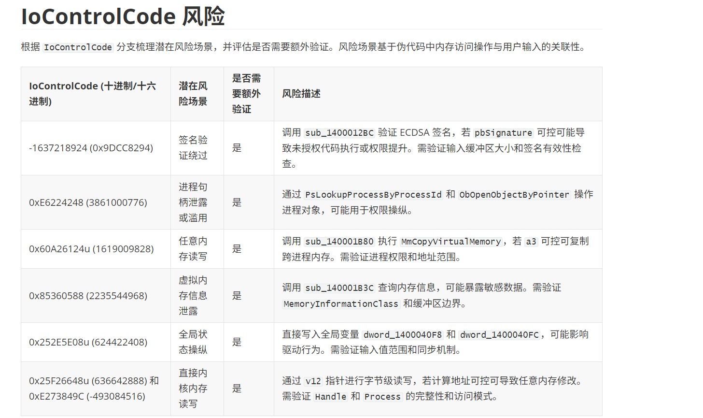
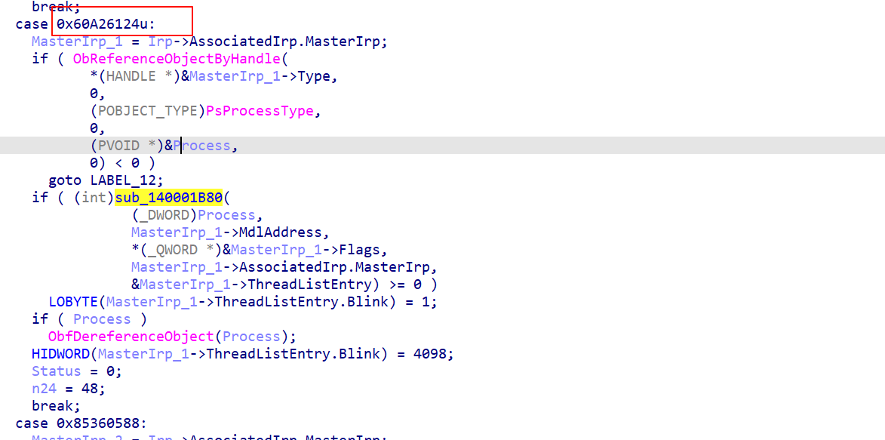
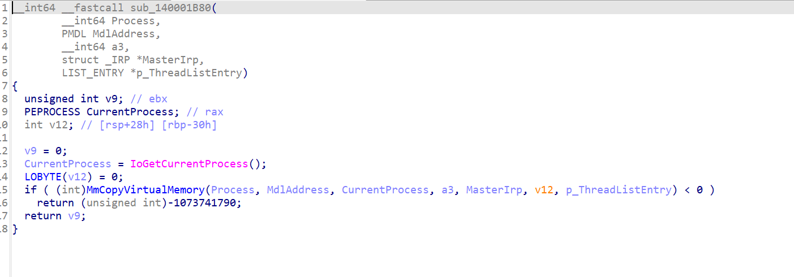

# 使用AI与IDA MCP协作挖掘漏洞驱动

**此程序未经过充分验证，demo性质。**

**此程序未经过充分验证，demo性质。**

**此程序未经过充分验证，demo性质。**

此程序至多跟踪 MajorFunction[14] 指向的分发函数的第二级。

## 环境要求

- Python 3.8+
- `pip install qwen-agent`
- 可访问的 Qwen API (`QWEN_API_KEY`)
- 已安装并可启动的 IDA Pro MCP 服务器（见 `examples/agent_config.py` 的默认路径）
- 运行脚本前需确保 IDA Pro 已经加载目标二进制


## 运行

```bash
python3 pipeline.py
```

等待一段时间，AI分析完毕后会出具一份 {{timestamp}}.md的报告。

使用echo_driver.sys的效果（下载地址：https://www.loldrivers.io/drivers/afb8bb46-1d13-407d-9866-1daa7c82ca63/ ）









